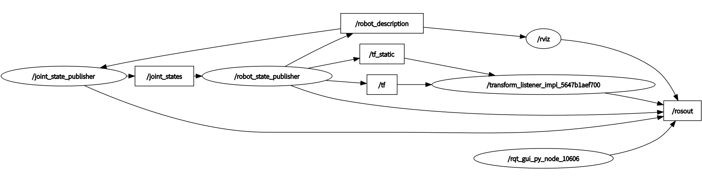
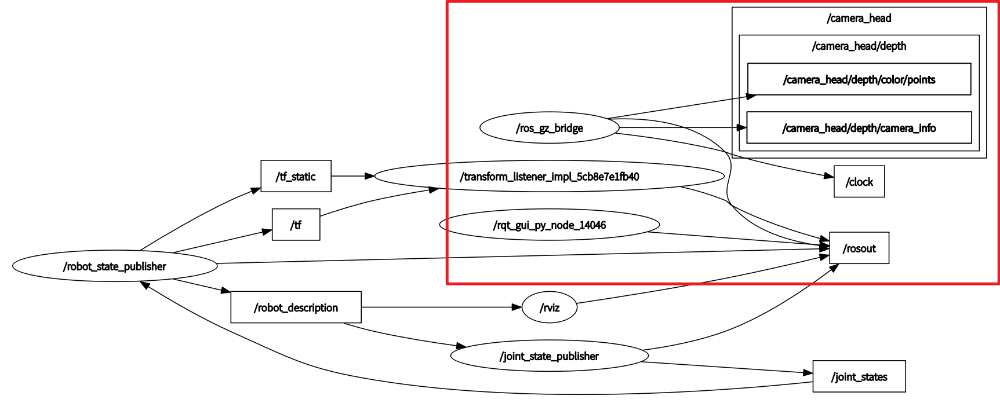

# Gazebo

## 1. Node
| Node                                    | 含义          | 作用                            |
| --------------------------------------- | ----------- | ---------------------------------- |
| `/joint_state_publisher` | 关节状态发布节点    | 根据 GUI 滑块产生关节角度，发布 `/joint_states` |
| `/robot_state_publisher` | 机器人状态发布节点   | 根据 URDF + 关节状态计算 TF                |
| `/rviz` | RViz2 内部可视化节点 | 负责 RViz 与 ROS 2 系统之间的主要数据交互，例如接收 /robot_description，并管理各种 Display、参数和可视化功能             |
| `/transform_listener_impl_xxx` | Rviz2 内部TF变化的节点      | 专门监听 /tf、/tf_static，获取坐标系之间的空间变换关系，供 RViz 内部进行可视化计算       |
|  `/ rviz + transform_listener_impl_xxx` |    综合使用    |      /rviz 负责获取机器人模型，/transform_listener 负责获取坐标变换，两者都属于 RViz 进程，RViz 综合这些数据完成最终的 3D 渲染     |
| `/rqt_gui_py_node_80634`                | rqt 自己的节点   | 负责 rqt 本身的运行                       |
|         `/ros_gz_bridge`        |   Gazebo 与 ROS 2 之间的数据桥接节点  |             按照 topic_bridge.yaml 的配置，在 Gazebo Topic 和 ROS 2 Topic 之间进行消息转换和传输             |

## 2. Topic
| Topic                | 含义    | 作用                |
| -------------------- | ----- | ----------------- |
| `/robot_description` | 机器人描述 | 存放/提供机器人 URDF 描述  |
| `/joint_states`      | 关节状态  | 当前各个关节的位置、速度、力等状态 |
| `/tf`                | 动态 TF | 发布会变化的坐标系变换       |
| `/tf_static`         | 静态 TF | 发布固定不变的坐标系变换      |
| `/parameter_events`  | 参数事件  | ROS 2 节点参数变化的通知   |
| `/rosout`            | 日志    | ROS 2 节点的日志输出     |
|   `/camera_head/depth/camera_info (bridge)`   |  深度相机参数  |  提供相机内参、畸变等信息 |
|   `/camera_head/depth/color/points (bridge)`   |  三维点云  |  提供相机获取的三维环境数据 |

## 3. Action

### 3.1 action_robot_description

#### 3.1.1 robot_description 机器人描述
|  relationship |  含义 |
|---|---|
|  /robot_state_publisher → /robot_description |  robot_state_publisher 发布机器人描述信息 |
|  /robot_description → /joint_state_publisher |  joint_state_publisher 使用机器人描述，才能控制机器人 |
|  /robot_description → /rviz |  rviz 使用机器人描述来知道机器人模型是什么 |

#### 3.1.2 joint_states 关节状态
|  relationship |  含义 |
|---|---|
|  /joint_state_publisher → /joint_states |  joint_state_publisher 发布当前关节状态 |
|  /joint_states → /robot_state_publisher |  robot_state_publisher 订阅当前关节状态 |

#### 3.1.3 TF 坐标变换
|  relationship |  含义 |
|---|---|
|  /robot_state_publisher → /tf |  robot_state_publisher 发布动态坐标变换 |
|  /robot_state_publisher → /tf_static |  robot_state_publisher 发布静态坐标变换 |
|  /tf → /transform_listener_impl_xxx |  TF Listener 订阅 /tf |
|   /tf_static → /transform_listener_impl_xxx  |   TF Listener 订阅 /tf_static   |

#### 3.1.4 rviz 机器人可视化
|  relationship |  含义 |
|---|---|
|  /robot_description → /rviz |  告诉 rviz 机器人的配置 |
|  /transform_listener_impl_xxx → /rviz (这一过程不通过 topic 通信) |  tf_listener 将 动/静 位姿变化告诉 rviz |

#### 3.1.5 Ros2 参数机制 (参数变化事件通知)
|  relationship |  含义 |
|---|---|
|  node → /parameter_events |  节点自己参数变化时，向外广播这件事 |
|   /parameter_events → node  |  节点监听全系统所有节点的参数变动事件 

#### 3.1.6 RosOut 日志通信
|  relationship |  含义 |
|---|---|
|  node → /rosout |  各个 Node 把 info / warn / error 等日志发布到 /rosout |

#### 3.1.7 RQT_Graph 话题节点关系查看器
|  relationship |  含义 |
|---|---|
|  /rqt_gui_py_node_80634 → /parameter_events |  rqt 的 Node 也属于 ROS 2 的参数系统，因此会 发布/参与 参数事件通信 |
|  /rqt_gui_py_node_80634 → /rosout |  rqt 的 Node 产生的日志，通过 /rosout 发布 |

### 3.2 parameter_bridge

#### 3.2.1 parameter_bridge

**特别的: /camera_head 和 /camera_head/depth 是两个框是在表示话题命名空间（Topic Namespace）的层级结构**
|  relationship |  含义 |
|---|---|
|  /ros_gz_bridge → /camera_head/depth/color/points |  深度相机生成的三维点云数据: Gazebo topic → Ros2 topic |
|  /ros_gz_bridge → /camera_head/depth/camera_info |  深度相机的相机参数信息: Gazebo topic → Ros2 topic  |

