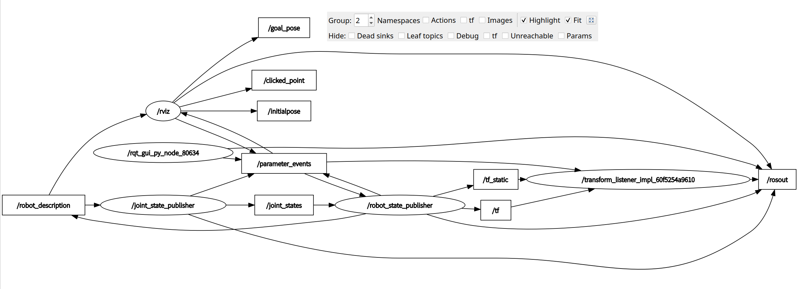

### 1. Node
| Node                                    | 含义          | 现在主要干什么                            |
| --------------------------------------- | ----------- | ---------------------------------- |
| `/joint_state_publisher` | 关节状态发布节点    | 根据 GUI 滑块产生关节角度，发布 `/joint_states` |
| `/robot_state_publisher` | 机器人状态发布节点   | 根据 URDF + 关节状态计算 TF                |
| `/rviz` | RViz2 可视化节点 | 显示机器人、TF 等，也可以发布一些交互信息             |
| `/transform_listener_impl_xxx` | TF 监听器      | 监听 `/tf`、`/tf_static` 中的坐标变换       |
| `/rqt_gui_py_node_80634`                | rqt 自己的节点   | 负责 rqt 本身的运行                       |

### 2. Topic
| Topic                | 含义    | 作用                |
| -------------------- | ----- | ----------------- |
| `/robot_description` | 机器人描述 | 存放/提供机器人 URDF 描述  |
| `/joint_states`      | 关节状态  | 当前各个关节的位置、速度、力等状态 |
| `/tf`                | 动态 TF | 发布会变化的坐标系变换       |
| `/tf_static`         | 静态 TF | 发布固定不变的坐标系变换      |
| `/parameter_events`  | 参数事件  | ROS 2 节点参数变化的通知   |
| `/rosout`            | 日志    | ROS 2 节点的日志输出     |
| `/goal_pose`         | 目标位姿  | RViz 等工具发布的导航目标   |
| `/initialpose`       | 初始位姿  | RViz 发布的机器人初始位姿   |
| `/clicked_point`     | 点击点   | RViz 中点击某个位置后发布的点 |

### 3. Relationship

#### 3.1. robot_description 机器人描述
|  relationship |  含义 |
|---|---|
|  /robot_state_publisher → /robot_description |  robot_state_publisher 发布机器人描述信息 |
|  /robot_description → /joint_state_publisher |  joint_state_publisher 使用机器人描述，才能控制机器人 |
|  /robot_description → /rviz |  rviz 使用机器人描述来知道机器人模型是什么 |

#### 3.2. joint_states 关节状态
|  relationship |  含义 |
|---|---|
|  /joint_state_publisher → /joint_states |  joint_state_publisher 发布当前关节状态 |
|  /joint_states → /robot_state_publisher |  robot_state_publisher 订阅当前关节状态 |

#### 3.3. TF 坐标变换
|  relationship |  含义 |
|---|---|
|  /robot_state_publisher → /tf |  robot_state_publisher 发布动态坐标变换 |
|  /robot_state_publisher → /tf_static |  robot_state_publisher 发布静态坐标变换 |
|  /tf → /transform_listener_impl_xxx |  TF Listener 订阅 /tf |
|   /tf_static → /transform_listener_impl_xxx  |   TF Listener 订阅 /tf_static   |

#### 3.4. rviz 机器人可视化
|  relationship |  含义 |
|---|---|
|  /robot_description → /rviz |  告诉 rviz 机器人的配置 |
|  /transform_listener_impl_xxx → /rviz (这一过程不通过 topic 通信) |  tf_listener 将 动/静 位姿变化告诉 rviz |

#### 3.5. rviz 发布的 topic
|  relationship |  含义 |
|---|---|
|  /rviz → /goal_pose |  我要机器人去某个位置 |
|  /rviz → /clicked_point |  我点击了某个位置 |
|  /rviz → /initialpose |  机器人初始位置在某个位置 |

#### 3.6. Ros2 参数机制 (参数变化事件通知)
|  relationship |  含义 |
|---|---|
|  node → /parameter_events |  节点自己参数变化时，向外广播这件事 |
|   /parameter_events → node  |  节点监听全系统所有节点的参数变动事件 |

#### 3.7. RosOut 日志通信
|  relationship |  含义 |
|---|---|
|  node → /rosout |  各个 Node 把 info / warn / error 等日志发布到 /rosout |

#### 3.8. RQT_Graph 话题节点关系查看器
|  relationship |  含义 |
|---|---|
|  /rqt_gui_py_node_80634 → /parameter_events |  rqt 的 Node 也属于 ROS 2 的参数系统，因此会 发布/参与 参数事件通信 |
|  /rqt_gui_py_node_80634 → /rosout |  rqt 的 Node 产生的日志，通过 /rosout 发布 |

